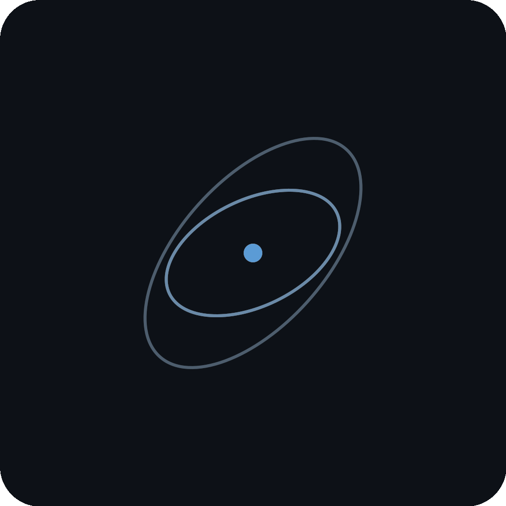

# nolan (hyperjet)
Const-generic hyperdual numbers for automatic differentiation in Rust

<a href="https://github.com/Empyrean-Dynamics/nolan/actions/workflows/rust.yml"></a>
<a href="https://crates.io/crates/hyperjet"></a>
<a href="https://docs.rs/hyperjet"></a>
<a href="https://opensource.org/licenses/BSD-3-Clause"></a>
<a href="https://doi.org/10.5281/zenodo.20210433"></a>
<br>
<a href="https://claude.ai"></a>
<a href="https://www.empyrean-dynamics.com"></a>
<a href="https://github.com/Empyrean-Dynamics"></a>

---

nolan is a **forward-mode automatic differentiation** library built around
**const-generic, stack-allocated hyperdual numbers** (jets). It provides
`Jet1<N>` for gradients, `Jet2<N, H>` for full Hessians, and `Jet3<N, H, T>`
for third-order tensors — all without `Vec` or `Box`, all generic over the
parameter dimension `N`. The same function body type-checks against `f64`
(no derivatives), `Jet1` (gradients), `Jet2` (Hessians), or `Jet3` (third-
order tensors). Linear algebra, statistics, grids, and angle-wrapping
primitives layered on top compose naturally with any jet order, so an
orbit-determination solve and its covariance propagation can share the
same code path.

The library was developed for astrodynamics — orbit determination,
covariance propagation, close-approach sensitivity analysis — but the
core types are domain-agnostic and useful anywhere exact, stack-allocated
forward-mode derivatives matter: optimization, robotics inverse kinematics,
physics simulation, ML gradient checking, sensitivity in scientific
computing.

## Installation

The crate is published on crates.io as [`hyperjet`](https://crates.io/crates/hyperjet).
The repo and internal codename stay `nolan`.

```toml
[dependencies]
hyperjet = "1.7.1"
```
```rust
use hyperjet::jets::Jet1;
```

Internal Empyrean callers can alias the dep back to `nolan` so existing
`use nolan::...` source keeps working unchanged:

```toml
[dependencies]
nolan = { package = "hyperjet", version = "1.7.1" }
```
```rust,ignore
use nolan::jets::Jet1;
```

## Types

### Jet1\<N\>

First-order jet: tracks a value and its gradient with respect to N parameters.

```rust
use hyperjet::jets::Jet1;

// Create a variable seeded at parameter index 0
let x = Jet1::<3>::variable(2.0, 0);
let y = Jet1::<3>::variable(3.0, 1);

let f = x * x + y;
assert_eq!(f.value, 7.0);     // 2² + 3
assert_eq!(f.grad[0], 4.0);   // ∂f/∂x = 2x = 4
assert_eq!(f.grad[1], 1.0);   // ∂f/∂y = 1
```

### Jet2\<N, H\>

Second-order jet: tracks value, gradient, and the full Hessian matrix
(stored as a lower-triangular array of size H = N(N+1)/2).

```rust
use hyperjet::jets::{Jet2, hess_size};

let x = Jet2::<2, { hess_size(2) }>::variable(2.0, 0);
let y = Jet2::<2, { hess_size(2) }>::variable(3.0, 1);

let f = x * x * y;
// f = x²y, value = 12
// ∂f/∂x = 2xy = 12, ∂f/∂y = x² = 4
// ∂²f/∂x² = 2y = 6, ∂²f/∂x∂y = 2x = 4, ∂²f/∂y² = 0
```

### Jet3\<N, H, T\>

Third-order jet: tracks value, gradient, Hessian, and the full third-order
tensor (stored as a lower-triangular array of size T = N(N+1)(N+2)/6).

```rust
use hyperjet::jets::{Jet3, hess_size, tens_size};

let x = Jet3::<1, { hess_size(1) }, { tens_size(1) }>::variable(1.0, 0);
let f = x.powi(4);
// f = x⁴, value = 1
// df/dx = 4x³ = 4
// d²f/dx² = 12x² = 12
// d³f/dx³ = 24x = 24
assert_eq!(f.tens[0], 24.0);
```

| Type | Storage (N=6) | Storage (N=9) |
|------|---------------|---------------|
| Jet1 | 56 B | 80 B |
| Jet2 | 224 B | 440 B |
| Jet3 | 672 B | 1,760 B |

### Type Aliases

```rust
# use hyperjet::jets::{Jet1, Jet2, Jet3};
type Dual = Jet1<1>;                     // Single-variable first derivative
type HyperDual = Jet2<2, 3>;            // Two-variable second derivatives
type HyperHyperDual = Jet3<2, 3, 4>;    // Two-variable third derivatives
```

## Traits

- **`Differentiable`** — Base trait: `value()`, `constant()`, `variable()`. Implemented for `f64`, `Jet1`, `Jet2`, `Jet3`.
- **`FirstOrder`** — First derivatives: `grad(i)`. Implemented for `Jet1`, `Jet2`, `Jet3`.
- **`SecondOrder`** — Second derivatives: `hess(i, j)`. Implemented for `Jet2`, `Jet3`.
- **`ThirdOrder`** — Third derivatives: `tens(i, j, k)`. Implemented for `Jet3`.
- **`DifferentiableMath`** — Transcendental functions: `sin`, `cos`, `tan`, `asin`, `acos`, `atan`, `atan2`, `sinh`, `cosh`, `tanh`, `exp`, `ln`, `log`, `sqrt`, `powf`, `powi`, `abs`.
- **`AutoDiff`** — Marker combining all of the above. Use this as a generic bound.

## Generic Programming

Write functions once that work with `f64` (no derivatives), `Jet1` (gradients),
`Jet2` (Hessians), or `Jet3` (third-order tensors):

```rust
use hyperjet::traits::AutoDiff;

fn gravity<J: AutoDiff>(x: J, y: J, z: J, mu: f64) -> [J; 3] {
    let r = (x * x + y * y + z * z).sqrt();
    let r3 = r.powi(3);
    // `J * f64` is in the `Differentiable` trait bound; `f64 * J` is not
    // generic over J, so we put the scalar on the right.
    [x * (-mu) / r3, y * (-mu) / r3, z * (-mu) / r3]
}
```

## Convenience API: `differentiate`

For one-shot derivative computations, the `differentiate` module hides the
Jet seeding + extraction boilerplate:

```rust,ignore
use hyperjet::differentiate::{differentiate1, differentiate2_6, differentiate3_6};

// First derivatives
let (value, grad) = differentiate1([1.5, 2.0], |[x, y]| x * y + x * x);
// value = 5.25, grad = [5.0, 1.5]

// Second derivatives (6-parameter specialization avoids spelling out H)
let (value, grad, hess) =
    differentiate2_6([1.0, 0.5, 0.1, 0.0, 0.0, 0.0], |[x, y, z, _, _, _]| {
        (x * x + y * y + z * z).sqrt()
    });

// Third derivatives
let (value, grad, hess, tens) = differentiate3_6(state, |xs| compute_miss_distance(xs));
```

Six variants: `differentiate1`/`differentiate2`/`differentiate3` for scalar
\\( f: \mathbb{R}^N \to \mathbb{R} \\), plus `_vec` variants for vector-valued
\\( f: \mathbb{R}^N \to \mathbb{R}^M \\) that return the full Jacobian (and
higher-order tensors stacked per output). Specialized `differentiate2_6`,
`differentiate2_9`, `differentiate3_6`, `differentiate3_9` helpers inline the
hessian/tensor sizes for the common 6- and 9-parameter state cases.

The wrapper is essentially overhead-free — the seeding + extraction is in the
same ballpark as the compute itself (~0.4 ns overhead on a 25 ns Jet1 gravity
evaluation, see `benchmark_jets.rs`).

### Runtime-dispatched `differentiate_dyn`

When the derivative order must be chosen at runtime — e.g., propagate with
Jet2 covariance by default, then escalate to Jet3 for skewness diagnostics
when a nonlinearity metric trips at a close-approach event — use the
dispatched form:

```rust,ignore
use hyperjet::differentiate::{
    differentiate_dyn_6, AutoDiffFn, Order, Derivatives,
};
use hyperjet::traits::AutoDiff;

// Write the function body once; it works for Jet1, Jet2, or Jet3.
struct MissDistance;
impl AutoDiffFn<6, 1> for MissDistance {
    fn eval<T: AutoDiff>(&self, xs: [T; 6]) -> [T; 1] {
        let [x, y, z, _vx, _vy, _vz] = xs;
        [(x * x + y * y + z * z).sqrt()]
    }
}

let order = if nonlinearity > threshold { Order::Third } else { Order::Second };
let d = differentiate_dyn_6(order, state, &MissDistance);

// Uniform consumption via accessors; hessians/tensors are Option.
let jac = d.jacobian();
if let Some(hess) = d.hessians() { /* use second-order term */ }
if let Some(tens) = d.tensors() { /* use third-order skewness */ }
```

The hessian and tensor fields are boxed so the enum stays small regardless
of dispatched order — `First` dispatch costs only ~7 ns more than the flat
`differentiate1_vec`.

## Linear Algebra

Stack-allocated generic matrix operations for any `N`:

```rust,ignore
use hyperjet::linalg::*;

// Solve Ax = b (Gauss-Jordan with scaled partial pivoting, NR §2.5)
let x = mat_solve(&a, &b).unwrap();

// Cholesky decomposition (symmetric positive-definite)
let l = mat_cholesky(&cov).unwrap();  // A = L L^T

// Inverses, eigen, and decompositions
let inv = mat_inv(&a).unwrap();
let d2 = mahalanobis_distance_squared(&x, &mu, &cov).unwrap();
let (v, lambda) = mat_eigenvector_max(&a, 100, 1e-12);
let (eigs, vecs) = mat_symmetric_eigen(&cov).unwrap();   // Jacobi
let kopp = sym_eigenvalues_3(&cov_3x3);                  // closed-form 3×3
let det = mat_det(&a);
let ld = mat_log_det(&a);
let kappa = condition_number(&a);                         // κ₂(A) = σ_max / σ_min
let sigma_max = mat_largest_singular_value(&a, 100, 1e-12);
let trace_cube = mat_trace_cube(&a, &b);                  // Tr((AB)³)

// Rectangular `f64`-only primitives over const-generic shapes
let c = mat_mul::<2, 3, 4>(&a_2x3, &b_3x4);              // 2×3 · 3×4 → 2×4
let at = mat_transpose::<2, 3>(&a_2x3);
let ata = mat_ata::<2, 3>(&a_2x3);                       // Aᵀ A, 3×3
let frob = mat_frobenius::<3, 4>(&a_3x4);
```

Scaled partial pivoting (NR §2.5) underpins all `mat_solve` / `mat_inv` /
`matN_solve` / `matN_inv` / `mat_det` paths via the shared
`hyperjet::linalg::NOLAN_REL_TOL` (1e-14) and `NOLAN_MIN_SCALE` (1e-150)
constants. `mat3_inv` / `mat3_solve` use a relative determinant guard
`|det| < REL_TOL · max_entry³`; for marginally-conditioned 3×3 inputs
prefer `mat_inv::<3>` (carries the scaled pivot).

Stack-allocated specialised fast paths for 3×3, 6×6, and 9×9 matrices
(`mat3_*`, `mat6_*`, `mat9_*`) — generic over `T: DifferentiableMath`
so they work with `f64` and Jet types alike.

### Covariance regularization (`hyperjet::linalg::regularize`)

```rust,ignore
use hyperjet::linalg::regularize::*;

// Project a possibly-indefinite covariance onto the PSD cone with a
// minimum eigenvalue floor (Higham 1988).
let report = nearest_psd::<6>(&cov, 1e-12).unwrap();
println!("clipped {} eigenvalues, max delta = {}",
    report.n_clipped, report.max_clip_magnitude);

// Tikhonov damping: A + αI.
let damped = tikhonov::<6>(&cov, 1e-9);

// Tikhonov with before/after κ₂ — surfaces under-damping at the call site.
let report = tikhonov_with_report::<6>(&cov, 1e-6);
if report.condition_number_after > 1e10 {
    // α was too small; retry with a larger damping factor.
}
```

The `RegularizationReport<N>` and `TikhonovReport<N>` structs are
`#[must_use]` — callers cannot silently drop the diagnostic fields.

## Optimization

Generic nonlinear least-squares solver (Gauss-Newton / Levenberg-Marquardt):

```rust,ignore
use hyperjet::optimization::*;

let solution = solve_nlls(
    |x: &[f64; 3]| {
        // Return residuals + Jacobian at x
        NLLSEvaluation { residuals, jacobian, cost }
    },
    [0.0; 3],           // initial guess
    &NLLSConfig::default(),
    None,                // optional Bayesian prior
).unwrap();

println!("x = {:?}, cost = {}", solution.x, solution.cost);
```

For stateful problems, implement the `NLLSProblem<N>` trait:

```rust,ignore
impl NLLSProblem<6> for MyProblem {
    fn evaluate(&mut self, x: &[f64; 6]) -> NLLSEvaluation<6> {
        // Propagate, compute residuals, extract Jacobian
    }

    // Optional: clamp each GN / LM step before it is applied. Useful
    // when the linear model overshoots its region of validity — e.g.,
    // orbit determination with rough seeds where a single unconstrained
    // step propagates to absurd epochs. Default impl is a no-op.
    fn constrain_step(&mut self, x: &[f64; 6], delta: &mut [f64; 6]) {
        let r_mag = (x[0].powi(2) + x[1].powi(2) + x[2].powi(2)).sqrt();
        let dr = (delta[0].powi(2) + delta[1].powi(2) + delta[2].powi(2)).sqrt();
        let max_dr = 0.5 * r_mag.max(1e-5);
        if dr > max_dr {
            let s = max_dr / dr;
            for k in 0..3 { delta[k] *= s; }
        }
        // ...and similarly for the velocity subvector.
    }
}
let solution = solve(&mut problem, x0, &config, prior)?;
```

Features: LM adaptive damping, Bayesian prior augmentation, second-order
Hessian correction (`solve2`), formal covariance extraction, optional
problem-driven step bounds.

## Statistics

`hyperjet::statistics::distributions` ships the scalar-input distribution
primitives:

```rust,ignore
use hyperjet::statistics::{ln_gamma, upper_inc_gamma_reg, chi2_sf,
                         normal_pdf, normal_cdf};

let p = chi2_sf(reduced_chi2 * dof as f64, dof);  // χ² survival
let z = (x - mu) / sigma;
let prob = normal_cdf(z);
```

`hyperjet::statistics::multivariate` ships N-dimensional Gaussian primitives
generic over the state dimension:

```rust,ignore
use hyperjet::statistics::{split_gaussian, sigma_points, sample_statistics};

// Canonical 2N+1 unscaled Julier-Uhlmann sigma points: sample_statistics
// over the returned set round-trips exactly to (mu, cov).
let points = sigma_points::<6>(&mu, &cov).unwrap();
let (mu_back, cov_back) = sample_statistics::<6>(&points).unwrap();

// Equal-weight Gaussian mixture decomposition along a chosen direction
// (DeMars-style uniform spacing; preserves the mixture mean and
// covariance for any K ≥ 1).
let components = split_gaussian::<6>(&mu, &cov, &direction, 3).unwrap();
```

## Grids

NumPy-semantics endpoint-inclusive grid generators and a clamping linear
interpolator:

```rust,ignore
use hyperjet::grids::{linspace, logspace, linear_clamped};

let lin = linspace(0.0, 1.0, 11);          // [0.0, 0.1, ..., 1.0]
let log = logspace(1e-3, 1e3, 7);          // log-spaced over 6 decades
let y = linear_clamped(&xs, &ys, query_x); // clamped at boundaries
```

`linear_clamped<T>` is generic over `T: Copy + Add<Output = T> + Mul<f64, Output = T>` —
so it works for scalar values and user-defined types that impl those traits.

## Angles

```rust,ignore
use hyperjet::angles::{wrap_pi, wrap_2pi, wrap_180, wrap_360};

let residual = wrap_pi(observed_ra - predicted_ra);  // half-open (-π, π]
let lon = wrap_2pi(atan2_result);                    // [0, 2π)
let dec_deg = wrap_180(d - d_ref);                   // (-180°, 180°]
```

## Version

```rust
println!("{}", hyperjet::version());
// Tagged release: "1.0.0"
// Development:    "1.0.1-dev+a3f7b2c"
// Dirty:          "1.0.1-dev+a3f7b2c-dirty"
```
